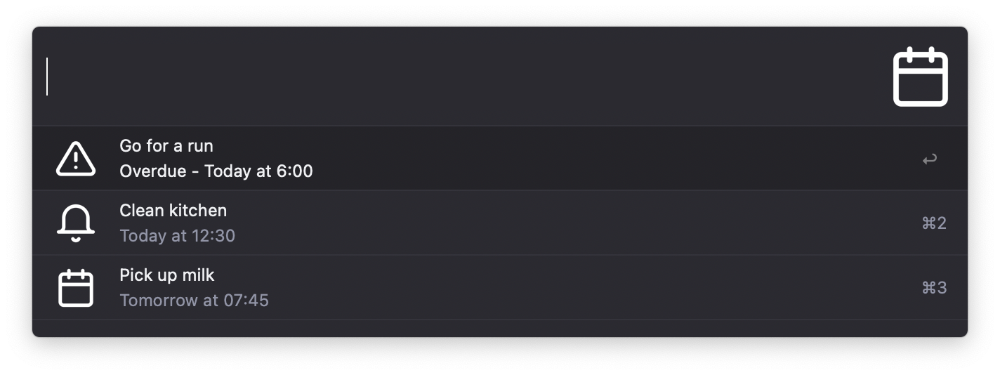
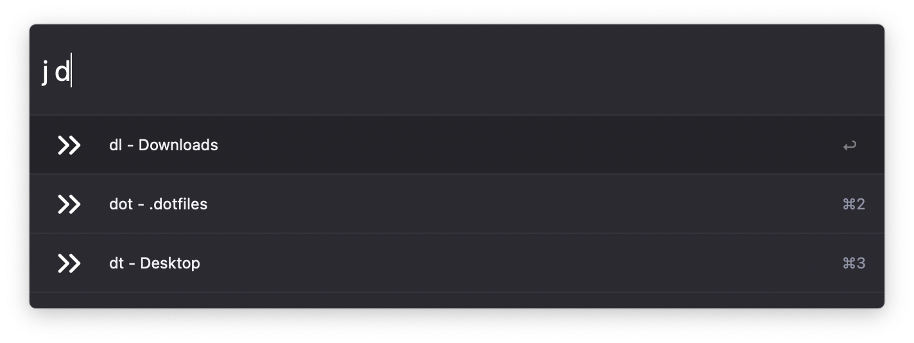
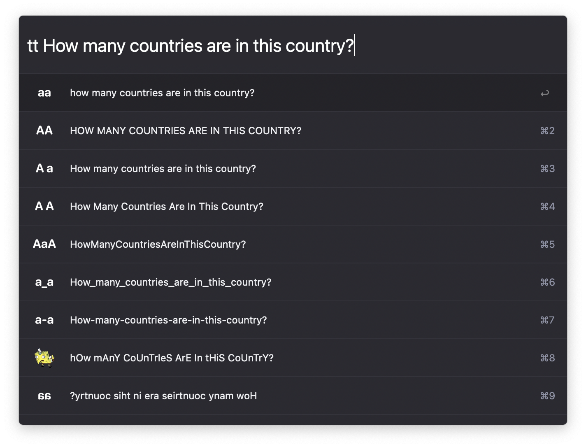
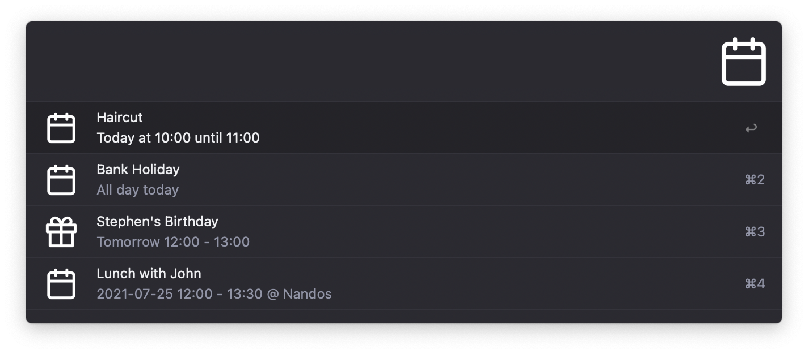
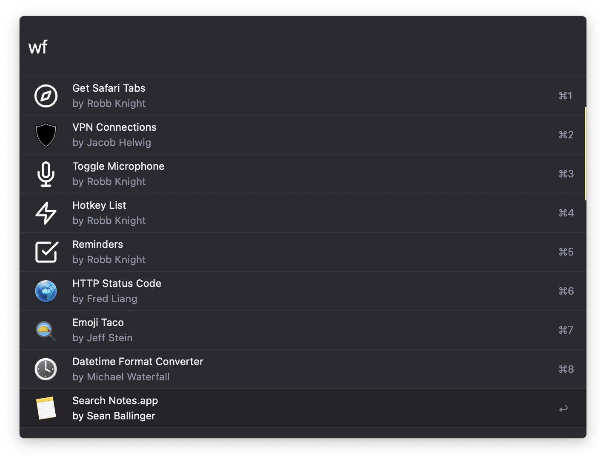
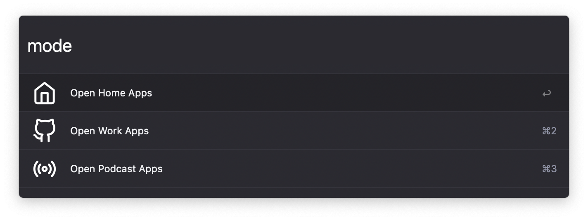

# My Alfred Workflows

[Alfred workflows](https://www.alfredapp.com/workflows/) I've made, ones that I use, and a script to automatically export mine.

Icons from [Feather Icons](https://feathericons.com)

Like these workflows? [Buy me a coffee](https://monzo.me/robbknight)

The theme in the screenshots is [Tempo Alternative (Dark)](https://github.com/chrismessina/alfred-theme-tempo#tempo-alternative-dark) by [Chris Messina](https://github.com/chrismessina).

## Setting up the backup script

[`backup.sh`](backup.sh) generates this readme file as well as backing up my workflows (and only mine, don't post other peoples workflows to your own repositories). The script works by doing the following:

- Looping through all workflows in my Alfred workflow directory
- If it has my bundle ID in the plist file, it extracts the metadata using `PListBuddy`, adds it to the first list below, then zips the workflow as an `.alfredworkflow`
- If it doesn't have my bundle ID, then it gets the name, author and website and puts them in the second list below

See the comments in the script to set this up for your own workflows

This part of the readme is set in `readme.example`## My Workflows

 _Some of these will completely useless to anyone but me_ 

### Monzo Link Generator

_Generate a Monzo.me link_ [Download v1.0.0](https://github.com/rknightuk/alfred-workflows/raw/main/workflows/monzo-link-generator.alfredworkflow) 

 

### Get Safari Tabs

_Copy all current Safari tabs to Markdown_ [Download v1.0.0](https://github.com/rknightuk/alfred-workflows/raw/main/workflows/safari-tabs-markdown.alfredworkflow) 

### Toggle Microphone

_Mute/Unmute microphone input_ [Download v1.0.0](https://github.com/rknightuk/alfred-workflows/raw/main/workflows/toggle-microphone.alfredworkflow) 

### Hotkey List

_List all workflows assigned to a hotkey_ [Download v1.0.0](https://github.com/rknightuk/alfred-workflows/raw/main/workflows/hotkey-list.alfredworkflow) 

 

### Reminders

_View and create reminders_ [Download v1.1.1](workflows/reminders) 

 

### Jump List

_ZSH Jump list plugin in Alfred_ [Download v1.0.0](https://github.com/rknightuk/alfred-workflows/raw/main/workflows/jump-list.alfredworkflow) 

 

### Toggle Wifi

_Toggle Wifi on/off_ [Download v1.0.0](https://github.com/rknightuk/alfred-workflows/raw/main/workflows/toggle-wifi.alfredworkflow) 

### Text Transform

_Transform text in various ways_ [Download v1.0.0](https://github.com/rknightuk/alfred-workflows/raw/main/workflows/text-transform.alfredworkflow) 

 

### Common Folders

_Open commonly used folders_ [Download v1.0.0](https://github.com/rknightuk/alfred-workflows/raw/main/workflows/common-folders.alfredworkflow) 

### Calendar Events

_View and create calendar events_ [Download v1.0.0](workflows/calendar-events) 

 

### Toggle Music

_Play/Pause Apple Music with hotkey_ [Download v1.0.0](https://github.com/rknightuk/alfred-workflows/raw/main/workflows/toggle-music.alfredworkflow) 

### Workflow Dev

_Open a workflows files in Sublime Text_ [Download v1.0.0](https://github.com/rknightuk/alfred-workflows/raw/main/workflows/workflow-dev.alfredworkflow) 

 

### Finder to Terminal

_Open the current finder window in Terminal_ [Download v1.0.0](https://github.com/rknightuk/alfred-workflows/raw/main/workflows/finder-to-terminal.alfredworkflow) 

### Toggle Dark Mode

_Toggle Dark/Light Mode_ [Download v1.0.0](https://github.com/rknightuk/alfred-workflows/raw/main/workflows/toggle-dark-mode.alfredworkflow) 

### Toggle Audio Output

_Switch audio output between MBP and Monitor_ [Download v1.0.0](https://github.com/rknightuk/alfred-workflows/raw/main/workflows/toggle-audio.alfredworkflow) 

### Paste Plain Text

 [Download v1.0.0](https://github.com/rknightuk/alfred-workflows/raw/main/workflows/paste-plain-text.alfredworkflow) 

### App Mode

_Open apps for different scenarios_ [Download v1.0.0](https://github.com/rknightuk/alfred-workflows/raw/main/workflows/computer-mode.alfredworkflow) 

 

## Third Party Workflows

- [VPN Connections by Jacob Helwig](https://technosorcery.net) 
- [HTTP Status Code by Fred Liang](https://github.com/ilstar/http_status_code) 
- [Emoji Taco by Jeff Stein](https://github.com/jeeftor/EmojiTaco) 
- [Datetime Format Converter by Michael Waterfall](twitter.com/mwaterfall) 
- [Search Notes.app by Sean Ballinger](https://github.com/sballin/alfred-search-notes-app) 
- [Speedtest by Michael Mroczka](http://michaelmroczka.com/) 
- [TablePlus by Chris Renga](https://www.chrisrenga.com) 
- [Amphetamine4 Switch by ShisaQ](https://shisaq.github.io) 
- [JustWatch - Alfred by VWAP](https://twitter.com/vinayw) 
- [Pocket for Alfred by Fabio Niephaus](https://github.com/fniephaus/alfred-pocket/) 
- [Lorem Ipsum by Till Krüss](https://till.im) 
- [IP Address v1.2.0 by David Ferguson](jdfwarrior.tumblr.com) 
- [TerminalFinder by LeEnno](http://www.ienno.de) 

