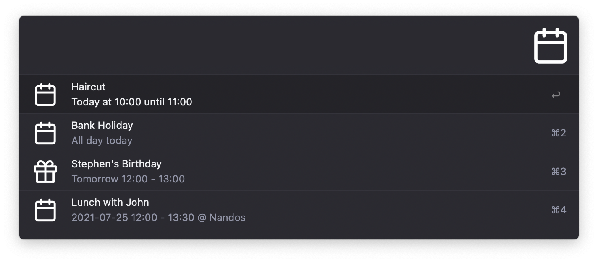

## Calendar Events Alfred Workflow

[Download Calendar Events for Alfred](https://github.com/rknightuk/alfred-workflows/raw/main/workflows/calendar-events/calendar-events.alfredworkflow)

The CLI is based on a modified version of my [alfred-reminders-helper](https://github.com/rknightuk/alfred-reminders-helper), which is a modified version of [keith/reminders-cli](https://github.com/keith/reminders-cli). View the [modified calendar events CLI here](https://github.com/rknightuk/alfred-calendars-helper).

NB: On first run, you'll get a warning about running an app from an unidentified developer. You have to open Preferences > Security and Privacy > General, then click "Allow".

### What does it do?

This workflow allows you to:

- View upcoming events (either all of them or for a specific calendar)
- Create new events for either your default list (set the variable on install) or for a specific list (`ce` > Calendars > Choose Calendar > Create New Event)
- Open an event in either Calendar.app or Fantastical
- Create events parsed with [Sherlock](https://github.com/neilgupta/Sherlock) or directly in Fantastical.
- Open the [Reminders workflow](https://github.com/rknightuk/alfred-workflows/blob/main/workflows/reminders) - you can turn this off with the `SHOWREMINDER` variable

To add a location to an event use `@ Location Name` at the end of your input. I recommend using the Fantastical option as the parsing is much better.

To use Fantastical for adding and opening events, edit the workflow variables and set `usefantastical` to `true`.

Keyword is `ce`

This workflow will automatically check for updates and download new versions.

Like this? [Buy me a coffee](https://monzo.me/robbknight)

The theme in the screenshot is [Tempo Alternative (Dark)](https://github.com/chrismessina/alfred-theme-tempo#tempo-alternative-dark) by [Chris Messina](https://github.com/chrismessina).

