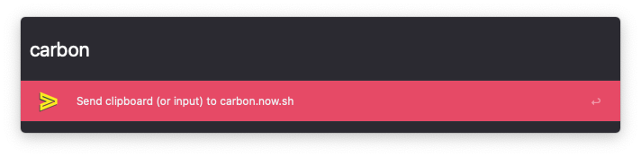

## Carbon Code Alfred Workflow

[Download Carbon Code](https://github.com/rknightuk/alfred-workflows/raw/main/workflows/carbonnowsh/carbonnowsh.alfredworkflow)

### What does it do?

Sends the clipboard contents or input to carbon.now.sh (https://carbon.now.sh?code=MYCODE)

Keyword is `carbon`

Like this? [Buy me a coffee](https://monzo.me/robbknight)

The theme in the screenshot is [Tempo Alternative (Dark)](https://github.com/chrismessina/alfred-theme-tempo#tempo-alternative-dark) by [Chris Messina](https://github.com/chrismessina).
