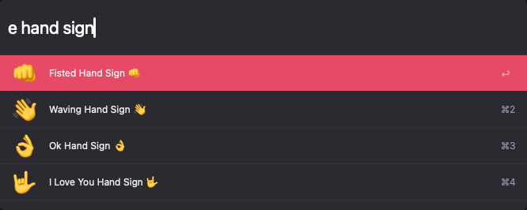

## Findmoji Alfred Workflow

[Download Findmoji](https://github.com/rknightuk/alfred-workflows/raw/main/workflows/findmoji/findmoji.alfredworkflow)

### What does it do?

Searches emoji and pastes to the frontmost application. Data based on [iamcal/emoji-data](https://github.com/iamcal/emoji-data).

Keyword is `e` plus a search term

Like this? [Buy me a coffee](https://www.buymeacoffee.com/rknightuk)

The theme in the screenshot is [Tempo Alternative (Dark)](https://github.com/chrismessina/alfred-theme-tempo#tempo-alternative-dark) by [Chris Messina](https://github.com/chrismessina).
