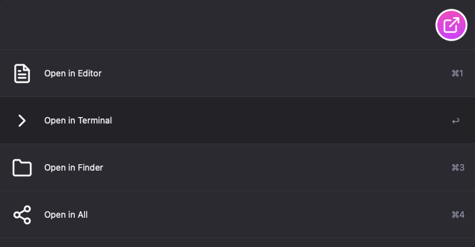

## File Actions Alfred Workflow

[Download File Actions](https://github.com/rknightuk/alfred-workflows/raw/main/workflows/findmoji/findmoji.alfredworkflow)

### What does it do?

Open folders and files in an editor, Finder, or Terminal

Use this in conjunction with other workflows

Like this? [Buy me a coffee](https://www.buymeacoffee.com/rknightuk)

The theme in the screenshot is [Tempo Alternative (Dark)](https://github.com/chrismessina/alfred-theme-tempo#tempo-alternative-dark) by [Chris Messina](https://github.com/chrismessina).
