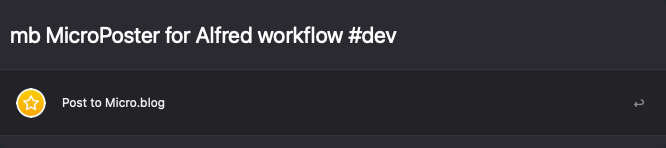

## MicroPoster Alfred Workflow

[Download MicroPoster](https://github.com/rknightuk/alfred-workflows/raw/main/workflows/microposter/microposter.alfredworkflow)

### What does it do?

Quickly post to Micro.blog from Alfred. Include categories using hastags e.g. `mb My great post about a book #books`.

1. Install the workflow
2. Get an API from Micro.blog [https://micro.blog/account/apps](https://micro.blog/account/apps)
3. Add the key to `api_key` in environment variables for the workflow
4. Add your domain under `site` in the environment variables for the workflow

Keyword is `mb`

Currently this will not handle categories with spaces in them.

Like this? [Buy me a coffee](https://www.buymeacoffee.com/rknightuk)

The theme in the screenshot is [Tempo Alternative (Dark)](https://github.com/chrismessina/alfred-theme-tempo#tempo-alternative-dark) by [Chris Messina](https://github.com/chrismessina).
