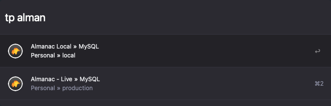

# TablePlus Workflow for Alfred

An ultra-fast [TablePlus](https://tableplus.io) search workflow for [Alfred 3](https://www.alfredapp.com).

This is a JXA version of [Chris Renga's PHP version](https://github.com/chrisrenga/alfred-tableplus). PHP is remove in MacOS Monterey, so I re-wrote it.



## Usage

Just type `tp` followed by your search query.

```
tp <query>
```

E.g.
```
tp local
```

press `<enter>` to open the connection.

## Credits

Thanks to [Chris Renga](https://github.com/chrisrenga) for doing all the hard work of working out how to do this in the first place.