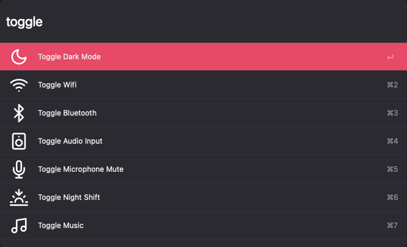

## Toggle Utils Alfred Workflow

[Download Toggle Utils](https://github.com/rknightuk/alfred-workflows/raw/main/workflows/toggle-utils/toggle-utils.alfredworkflow)

### What does it do?

Various scripts in one workflow to toggle different things:

- Wifi `toggle wifi/wifi toggle`
- Bluetooth `toggle bluetooth/bluetooth toggle`
- Dark Mode `toggle darkmode/darkmode toggle`
- Music `toggle music` + hotkey

Below are very specific to my setup:

- Microphone `toggle microphone` + hotkey
- Audio in/output `toggle audio input` + hotkey

General keyword is `toggle`

Like this? [Buy me a coffee](https://monzo.me/robbknight)

The theme in the screenshot is [Tempo Alternative (Dark)](https://github.com/chrismessina/alfred-theme-tempo#tempo-alternative-dark) by [Chris Messina](https://github.com/chrismessina).
