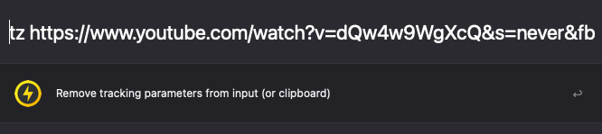

## TrackerZapper Alfred Workflow

[Download TrackerZapper](https://github.com/rknightuk/alfred-workflows/raw/main/workflows/trackerzapper/trackerzapper.alfredworkflow)

### What does it do?

Removes tracking parameters from URLs either from an input `tz INPUT` or from the clipboard. 

Keyword is `tz`

I also made [TrackerZapper for Mac](https://rknight.me/apps/tracker-zapper/) to do the same thing but automatically in the background.

Like this? [Buy me a coffee](https://www.buymeacoffee.com/rknightuk)

The theme in the screenshot is [Tempo Alternative (Dark)](https://github.com/chrismessina/alfred-theme-tempo#tempo-alternative-dark) by [Chris Messina](https://github.com/chrismessina).
