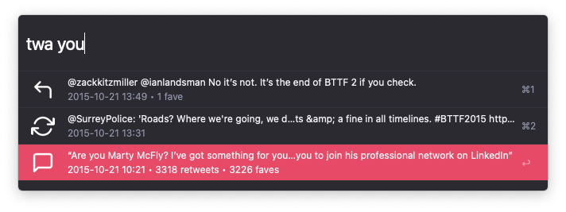

## Twitter Archive Search Alfred Workflow

[Download Twitter Archive Search](https://github.com/rknightuk/alfred-workflows/raw/main/workflows/twitter-archive-search/twitter-archive-search.alfredworkflow)

### What does it do?

- Searches your Twitter archive.
- Optionally include retweets and replies in the workflow variables.
- Enter to open the tweet
- ⌘+c to copy tweet URL to clipboard
- ⌘+l to see in large type
- ⇧ to quicklook the tweet

Keyword is `twa` + your search term (minimum of 3 characters for performance reasons)

### Setup

- Request your Twitter here: https://help.twitter.com/en/managing-your-account/how-to-download-your-twitter-archive
- In the workflow variables, set the path to your `tweet.js` file (this is in the `data` of the download). For example, `/Users/alfreduser/Dropbox/Twitter Archive/data/tweet.js`

Like this? [Buy me a coffee](https://monzo.me/robbknight)

The theme in the screenshot is [Tempo Alternative (Dark)](https://github.com/chrismessina/alfred-theme-tempo#tempo-alternative-dark) by [Chris Messina](https://github.com/chrismessina).
